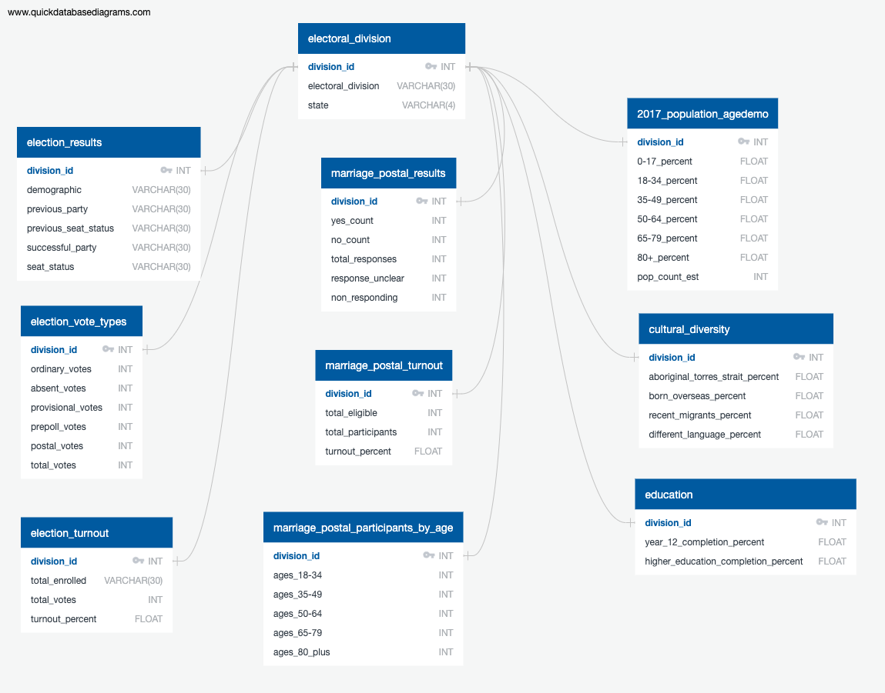

# ETL Project

## Project Overview

This project creates a relational database that can be used for trend analysis on election and survey results in relation to the Australian electoral divisions. It includes data about the 2016 Australian Federal Elections, the 2017 Australian Marriage Law Postal Survey and the Commonwealth Electorates.

## How is the database sourced?

Data has been retrieved through the use of document downloads and web scraping. Any downloaded files are located in the resources folder. Jupyter notebooks are then used to access, transform and export the data.

## How is the database implemented?

The Jupiter notebooks should be run in the order they are numbered. For example  `01-extracting_transforming_electoral_division.ipynb` should be run first, followed by `02-extracting_transforming_election_results.ipynb` and so on, up to notebook 10.
The schema.sql file should be run in PostgreSQL prior to running notebook `11-Load.ipynb`. 
A `login_details.py` file will need to be created which contains username = “username” and password = “password” with the specific information related to the users PostgreSQL login information.

A PostgreSQL database will then be created, as per the ERD below:

## Credits

Data sourced from:

- Australian Electoral Commission: [2016 Federal Election Vote Types by Division](https://results.aec.gov.au/20499/Website/HouseDownloadsMenu-20499-Csv.htm)
- Australian Electoral Commission: [2016 Federal Election Results](https://results.aec.gov.au/20499/Website/HouseDivisionClassifications-20499-NAT.htm)
- Kaggle: Australian Marriage Law Postal Survey [Electorate Results](https://www.kaggle.com/mylesoneill/australian-marriage-law-postal-survey?select=electorate-results.csv)
- Kaggle: Australian Marriage Law Postal Survey [Participant Information](https://www.kaggle.com/mylesoneill/australian-marriage-law-postal-survey?select=participant-information.csv)
- Australian Bureau of Statistics: [Commonwealth Electorate Data](https://www.abs.gov.au/AUSSTATS/abs@.nsf/DetailsPage/2082.02019?OpenDocument)
